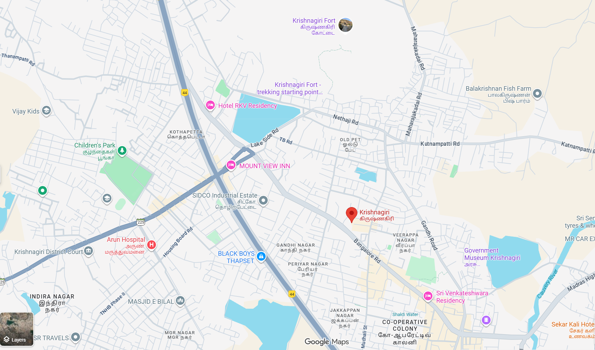
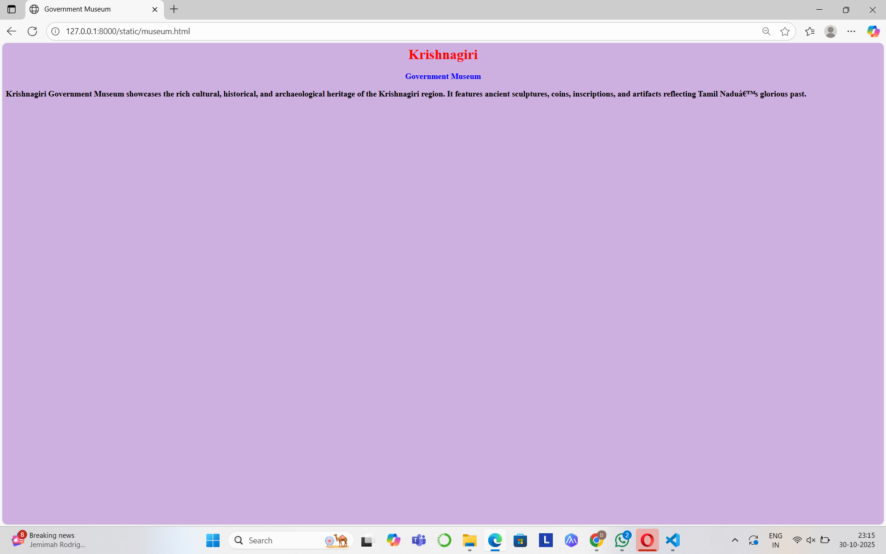
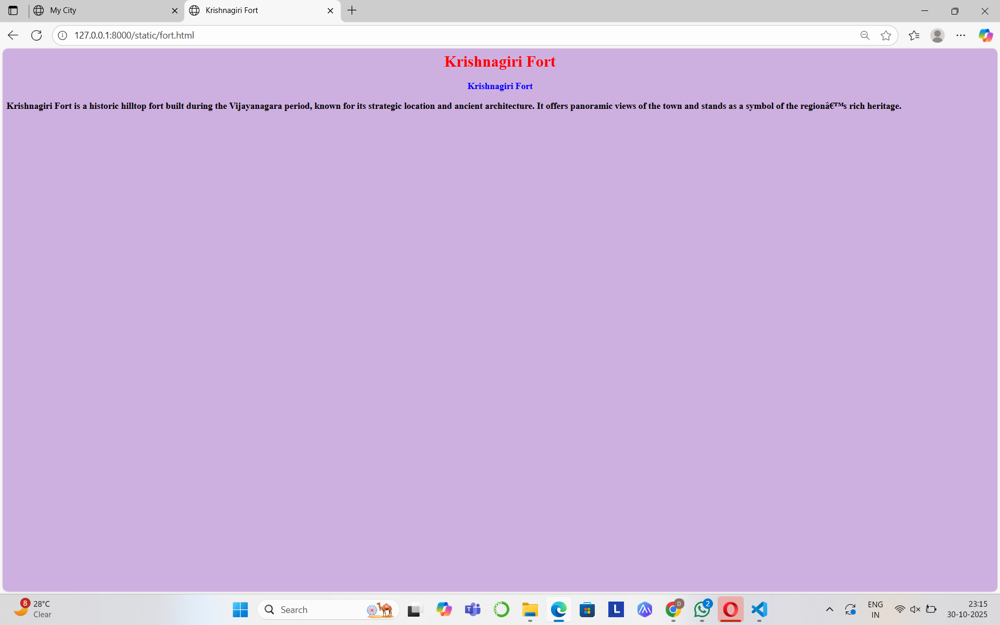
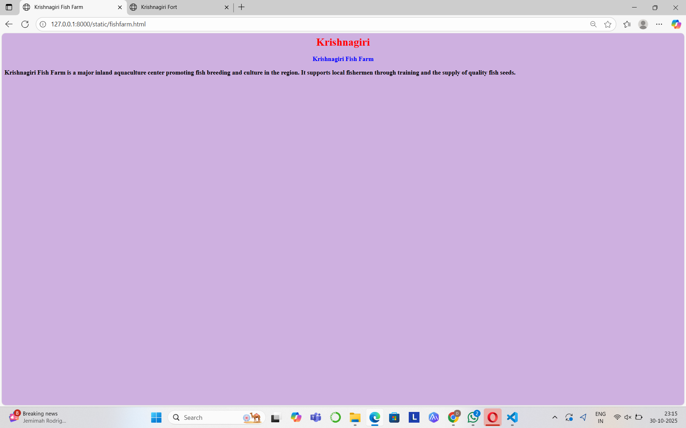
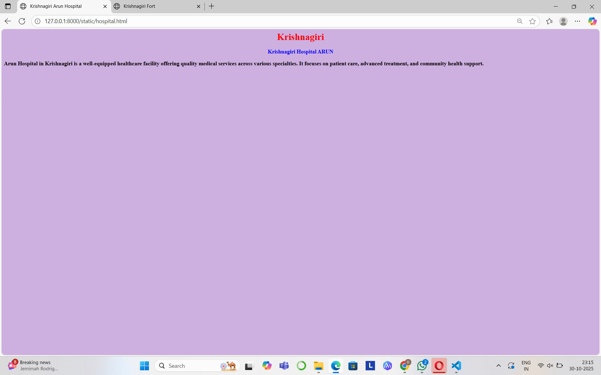

# Ex04 Places Around Me
## Date: 30-10-2025

## AIM
To develop a website to display details about the places around my house.

## DESIGN STEPS

### STEP 1
Create a Django admin interface.

### STEP 2
Download your city map from Google.

### STEP 3
Using ```<map>``` tag name the map.

### STEP 4
Create clickable regions in the image using ```<area>``` tag.

### STEP 5
Write HTML programs for all the regions identified.

### STEP 6
Execute the programs and publish them.

## CODE
```
map.html
<html>
    <head>
        <title>My City</title>
    </head>
    <body>
        <h1 align="center">
            <font colour="CadetBlue"><b>Krishnagiri</b></font>
        </h1>
        <h3 align="center">
            <font colour="red"><b>Dharshini J 212224240036 </b></font>
        </h3>
        <center>
            
            <map name="image-map">
            <area target="_self" alt="fort" title="fort" href="fort.html" coords="940,64,102" shape="circle">
            <area target="_self" alt="park" title="park" href="park.html" coords="322,436,112" shape="circle">
            <area target="_self" alt="museum" title="museum" href="museum.html" coords="1397,730,97" shape="circle">
            <area target="_self" alt="fishfarm" title="fishfarm" href="fishfarm.html" coords="1442,277,103" shape="circle">
            <area target="_self" alt="hospital" title="hospital" href="hospital.html" coords="370,692,89" shape="circle">

            </map>
        </center>
    </body>
</html>
museum.html

<html>
    <head>
        <title>Government Museum</title>
    </head>
    <body bgcolor="ICE BLUE"></bgcolor>
        <h1 align="center">
            <font color="red">
                Krishnagiri
            </font>
        </h1>
    <h3 align="center">
        <font color="blue">
        Government Museum
    </font></h3>
<h3>Krishnagiri Government Museum showcases the rich cultural, historical, and archaeological heritage of the Krishnagiri region. It features ancient sculptures, coins, inscriptions, and artifacts reflecting Tamil Nadu’s glorious past.</h3>
</body>
</html>


fort.html

<html>
    <head>
        <title>Krishnagiri Fort</title>
    </head>
    <body bgcolor="ICE BLUE"></bgcolor>
        <h1 align="center">
            <font color="red">
                Krishnagiri Fort
            </font>
        </h1>
    <h3 align="center">
        <font color="blue">
        Krishnagiri Fort
    </font></h3>
<h3>Krishnagiri Fort is a historic hilltop fort built during the Vijayanagara period, known for its strategic location and ancient architecture. It offers panoramic views of the town and stands as a symbol of the region’s rich heritage.</h3>
</body>
</html>

fishfarm.html
<html>
    <head>
        <title>Krishnagiri Fish Farm</title>
    </head>
    <body bgcolor="ICE BLUE"></bgcolor>
        <h1 align="center">
            <font color="red">
                Krishnagiri
            </font>
        </h1>
    <h3 align="center">
        <font color="blue">
        Krishnagiri Fish Farm
    </font></h3>
<h3>Krishnagiri Fish Farm is a major inland aquaculture center promoting fish breeding and culture in the region. It supports local fishermen through training and the supply of quality fish seeds.</h3>
</body>
</html>

hospital.html

<html>
    <head>
        <title>Krishnagiri Arun Hospital</title>
    </head>
    <body bgcolor="ICE BLUE"></bgcolor>
        <h1 align="center">
            <font color="red">
                Krishnagiri
            </font>
        </h1>
    <h3 align="center">
        <font color="blue">
        Krishnagiri Hospital ARUN
    </font></h3>
<h3>Arun Hospital in Krishnagiri is a well-equipped healthcare facility offering quality medical services across various specialties. It focuses on patient care, advanced treatment, and community health support.</h3>
</body>
</html>

park.html

<html>
    <head>
        <title>Krishnagiri Childrens Park</title>
    </head>
    <body bgcolor="ICE BLUE"></bgcolor>
        <h1 align="center">
            <font color="red">
                Krishnagiri
            </font>
        </h1>
    <h3 align="center">
        <font color="blue">
        Krishnagiri Childrens Park
    </font></h3>
<h3>Krishnagiri Children’s Park is a popular recreational spot designed for kids with play areas, rides, and open green spaces. It offers a safe and enjoyable environment for families to relax and spend time together.</h3>
</body>
</html>
```


## OUTPUT







## RESULT
The program for implementing image maps using HTML is executed successfully.
